The FAS 6004 is a distinctive single-stroke pneumatic (SSP) air pistol for 10-meter target shooting, combining beautiful Italian design with a self-contained power system. One compression stroke supplies the air for each shot, so there is no separate air cylinder to fill or CO2 cartridge to replace.

## The Design

I initially bought the FAS 6004 because, to my eye, it is the most beautiful—and sexiest—SSP air pistol available today. Its slim black upper assembly and sculpted wooden grip give it a distinctive silhouette, with warm wood grain complementing the clean metalwork.

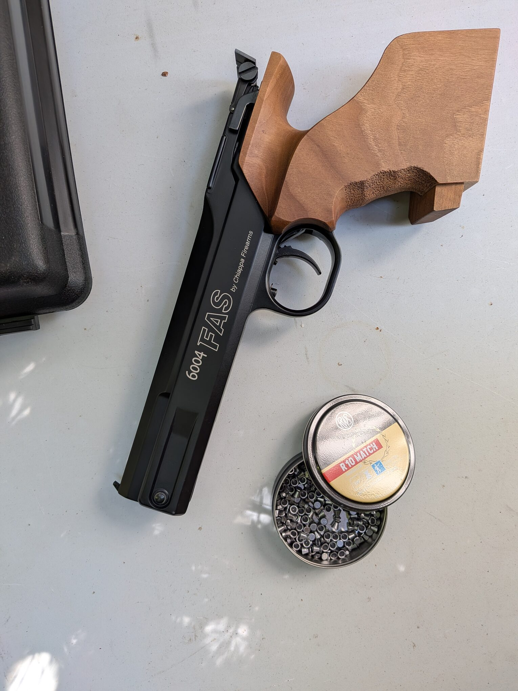

Below, the **ambi (ambidextrous) grip** is on the left and the **medium-size match grip** is on the right. The match grip adds an adjustable palm shelf and more pronounced contours around the hand.

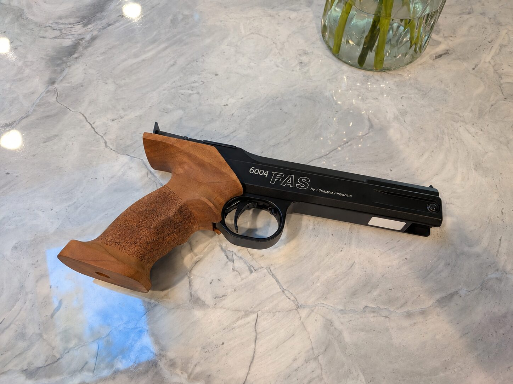

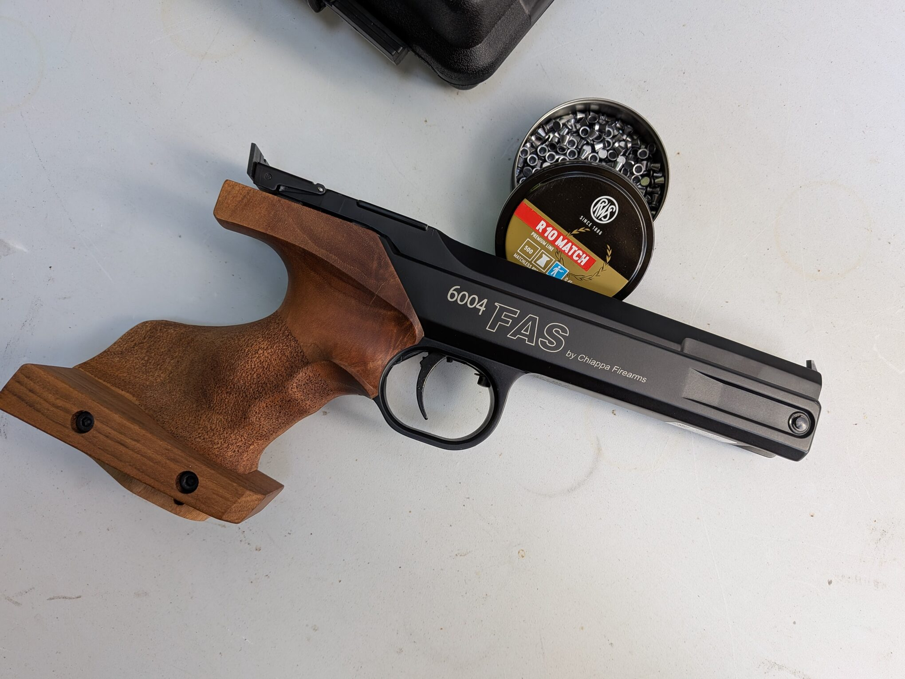

These close-ups show my favorite detail: the way the curved wood meets the straight frame. The textured grip surfaces and smooth edges give the shape definition without making it look busy.

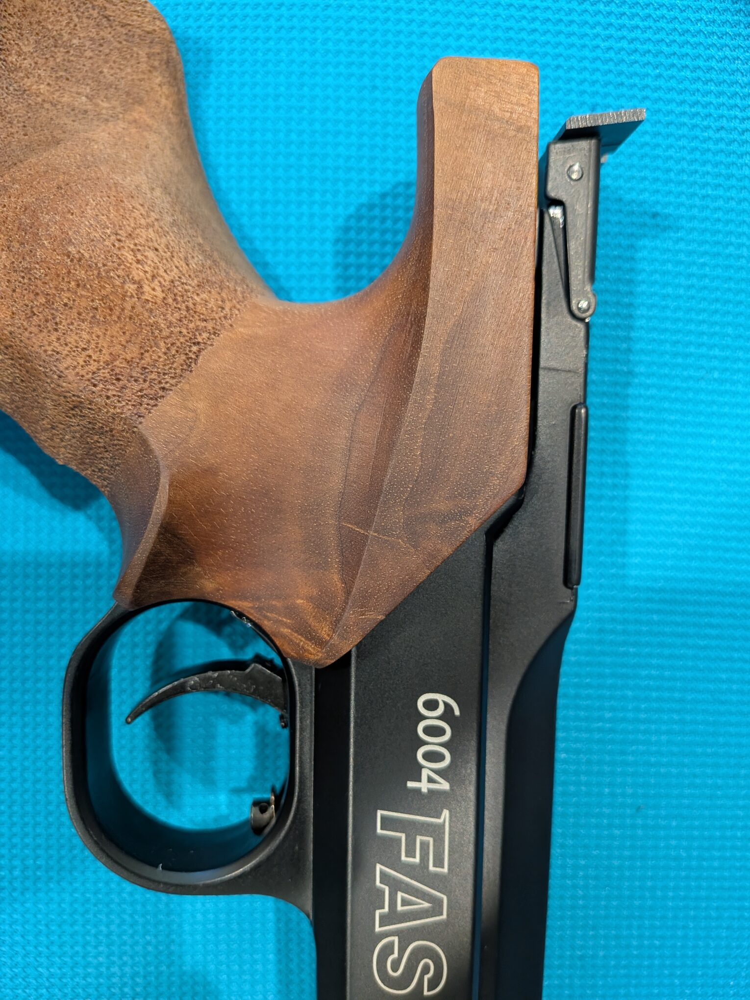

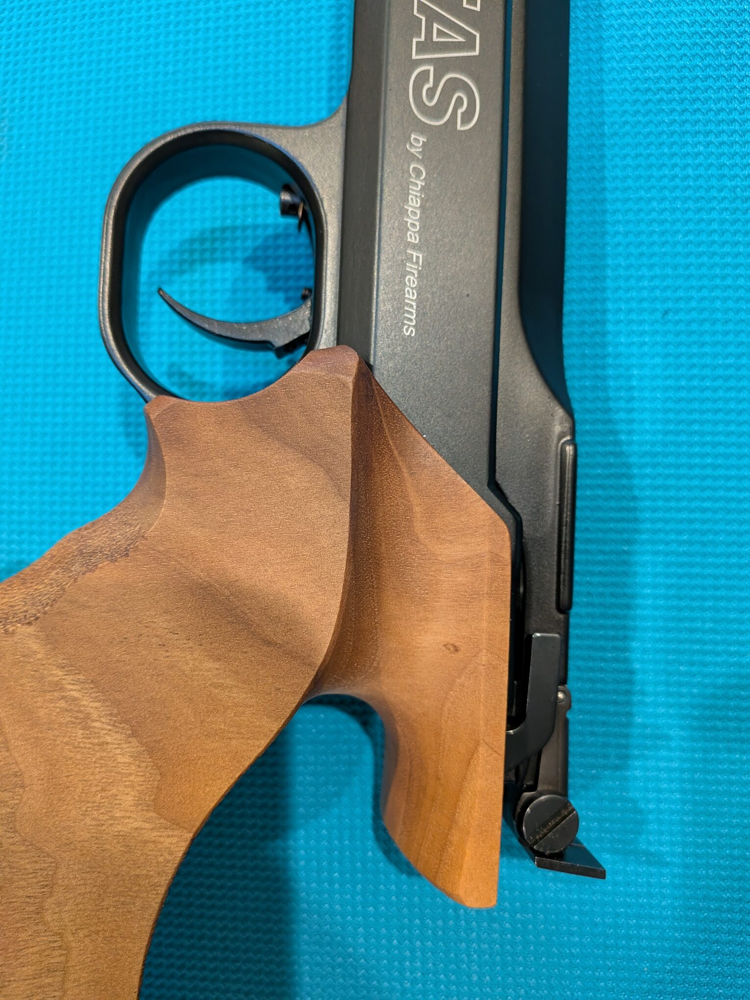

From above, fine parallel grooves emphasize the pistol's slim profile and draw the eye toward the front sight.

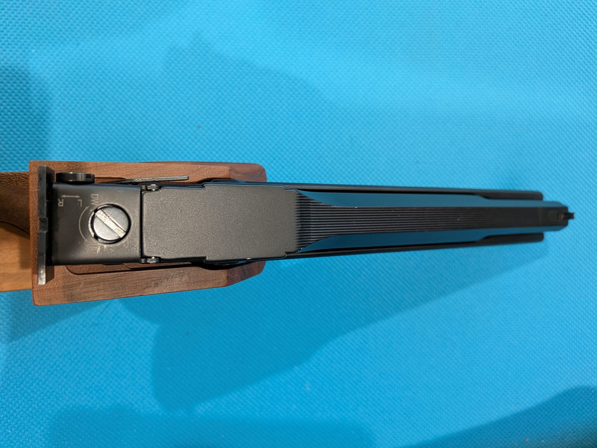

The grooves can also reduce distracting glare along the top surface, helping the sights stand out in bright light. They provide a visual lead toward the front sight; precise alignment still comes from the front blade and rear notch.

Like its predecessor, the FAS 604, the FAS 6004 has a replaceable front sight. The close-up below shows the blade and its mounting at the front of the upper assembly. The rear sight provides both windage and elevation adjustment. I also like its bold, simple shape—especially the broad, uncluttered face that I see from behind the pistol.

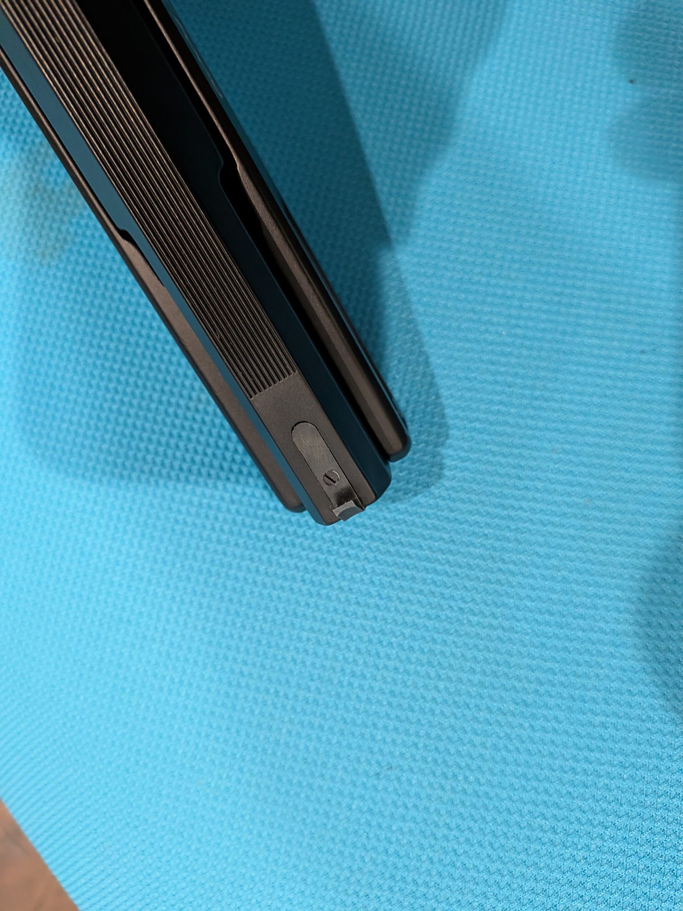

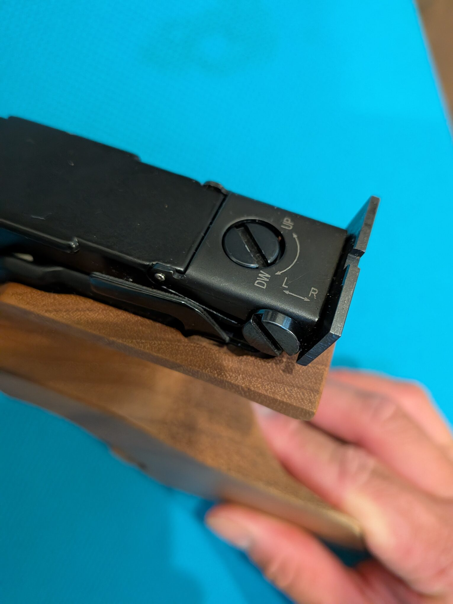

## Alongside the HW45 / HW75

Placed beside the HW45, the FAS has a noticeably different visual character: a narrow upper assembly flowing into a large target grip, alongside the HW45's more conventional pistol outline.

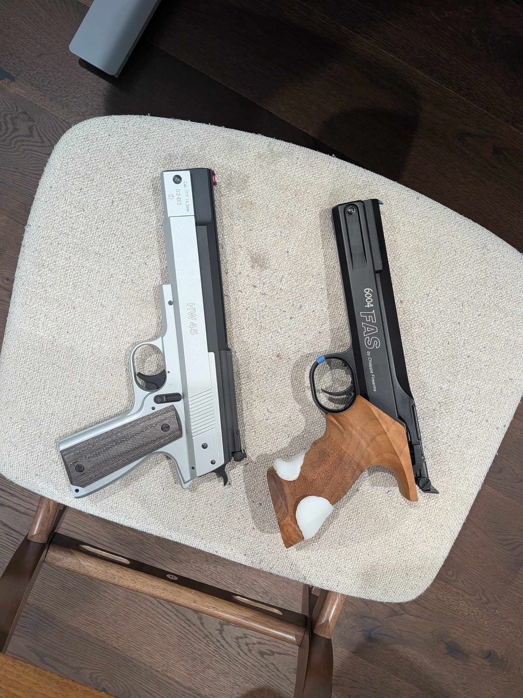

The HW75 is a closer comparison mechanically, since both use pre-compressed air. In the photo below, the difference in grip shape is especially clear. The white additions visible on the FAS grip are specific to this example and are not part of the standard wooden grip.

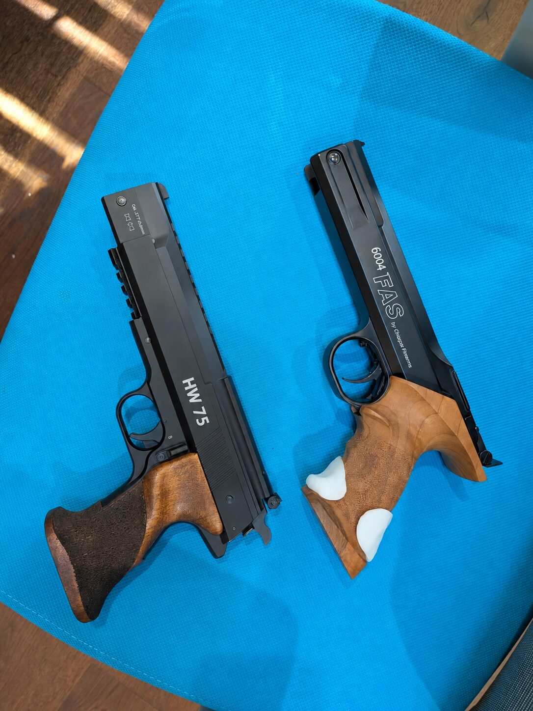

Another difference visible in these comparisons is how low the FAS's barrel sits relative to the top of the grip. Its **high grip and low barrel line** give it a layout of a dedicated 10-m competition pistol. Bringing the barrel axis closer to the supporting hand shortens the lever arm through which recoil can rotate the pistol upward—the general principle behind a low bore axis. It can support a more controlled hold and potentially better practical accuracy.

## Shooting experiences

The medium-size match grip feels **comfortable and steady in my hand when shooting**. Its sculpted shape is more than something I enjoy looking at: it feels right when I hold the pistol up to aim. That fit is personal, of course, but for my hand it is one of the FAS 6004's strongest points.

Aiming with the FAS 6004 feels much better to me than with my HW45 or HW75. **The bold rear sight gives me a crisp, clear sight picture, and its simplicity makes it comfortable to look through and focus.** Together with the steady feel of the match grip, it makes aiming a particularly enjoyable part of shooting this pistol.

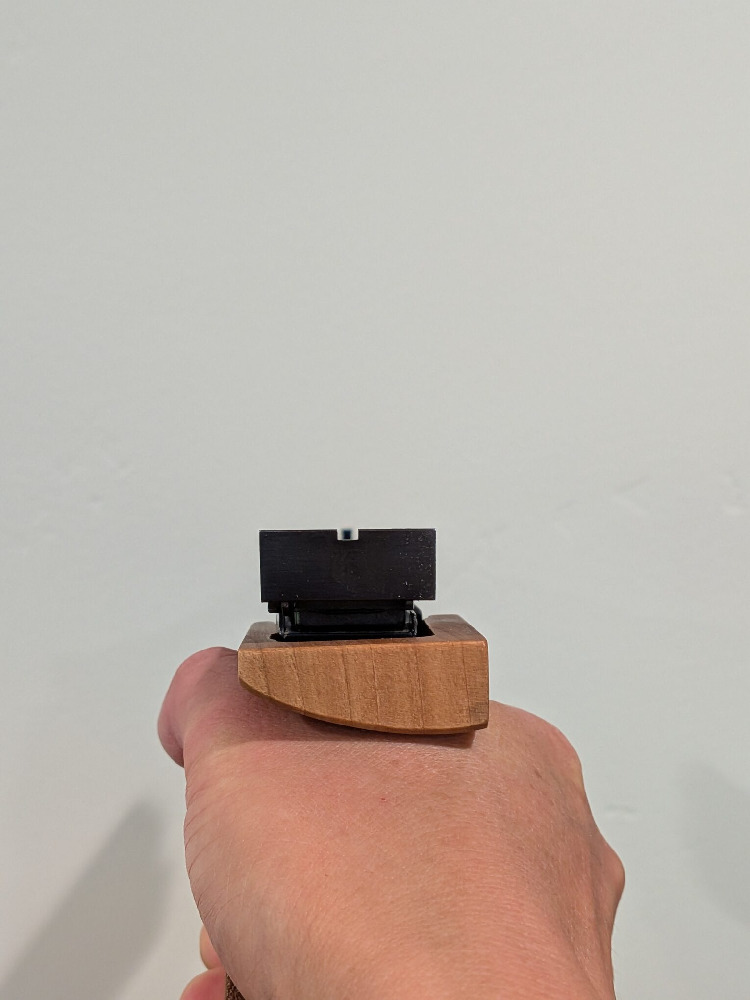

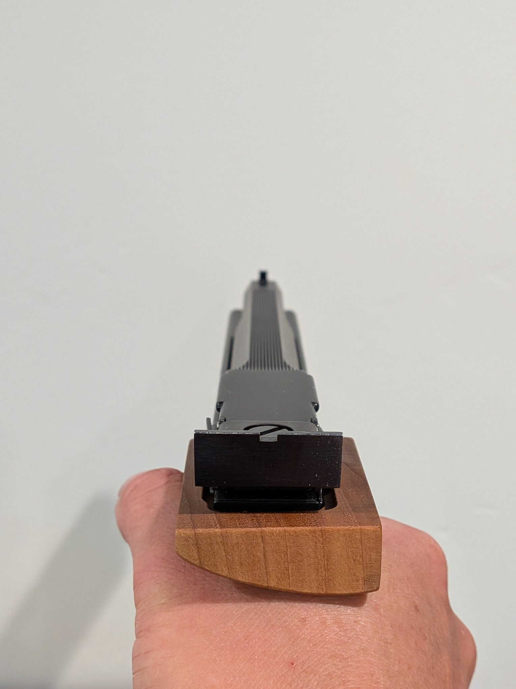

I have seen comments that the front sight blade is too thick. **To my eye, its width is just right.** I actually feel more comfortable aiming with it at this width; I do not find myself wishing for a thinner blade. That comfortable sight picture makes a real difference to how much I enjoy shooting the FAS.

## Specifications

The FAS 6004, Weihrauch HW75, and Air Venturi V10 are all single-shot, .177-caliber SSP match pistols. Here is how their published specifications compare. The FAS dimensions and weight below refer to Chiappa's ambidextrous-grip model.

| Specification | 6004 | HW75 | V10 |
| --- | --- | --- | --- |
| Overall length | 266 mm / 10.5 in | 280 mm / 11.0 in | 320 mm / 12.6 in |
| Weight | 0.91 kg / 2.00 lb | 1.06 kg / 2.34 lb | 0.88 kg / 1.95 lb |
| Barrel length | 191 mm / 7.5 in | 170 mm / 6.7 in |  210 mm / 8.26 in |
| Trigger | Adjustable pressure, take-up, and stages | Two-stage match trigger | Two-stage adjustable trigger |
| Grip | Ambidextrous walnut / match-grip versions | Ambidextrous walnut sport grip | Contoured wooden target grip; handed versions listed |
| Approx. velocity | 100 m/s / 330 fps | 125 m/s / 410 fps | Up to 122 m/s / 400 fps |

These velocities are manufacturer figures, rather than results from a common test with the same pellet. Chiappa's current product page gives approximately 330 fps, although its [older FAS 6004 technical sheet](https://cloud.chiappafirearms.com/vfm-admin/vfm-downloader.php?h=512b8b04f3477968c784b97c7cda29d0&q=dXBsb2Fkcy9DaGlhcHBhLUZpcmVhcm1zLzAwNl9JTUFHRVMvUHJvZHVjdC1JbWFnZXMvRkFTLTYwMDQvVGVjaC1TaGVldC9TcGVjcy00NDAtMDQwXzA0MS0wNDNfRkFTLTYwMDQucGRm) lists approximately 400 fps. Actual velocity depends on the pellet and the individual pistol. In fact, my pistol consistently delivered around **355–365 fps with RWS R10 Match pellets** in my testing, averaging 359.5 fps across 25 shots. Please see the [chronograph results below](#consistency-on-the-chronograph) for the full results.

On paper, the FAS is the shortest of these three in its ambidextrous configuration. The HW75 is the heaviest, while the V10 pairs a longer barrel with a relatively low overall weight. The FAS's compact size and relatively low weight can make it easier to handle and less tiring to hold, especially compared with the heavier HW75. For a shooter who finds that size and weight comfortable, this can help maintain a steady hold and potentially improve practical accuracy. The benefit depends on grip fit and personal preference, rather than smaller size or lower weight alone guaranteeing better accuracy. Together with its adjustable trigger and distinctive styling, that manageable form is a large part of the FAS's appeal.

## Consistency on the Chronograph

I used RWS R10 Match pellets for this session. The Garmin chronograph recorded 25 shots on September 10, 2026, with the following results:

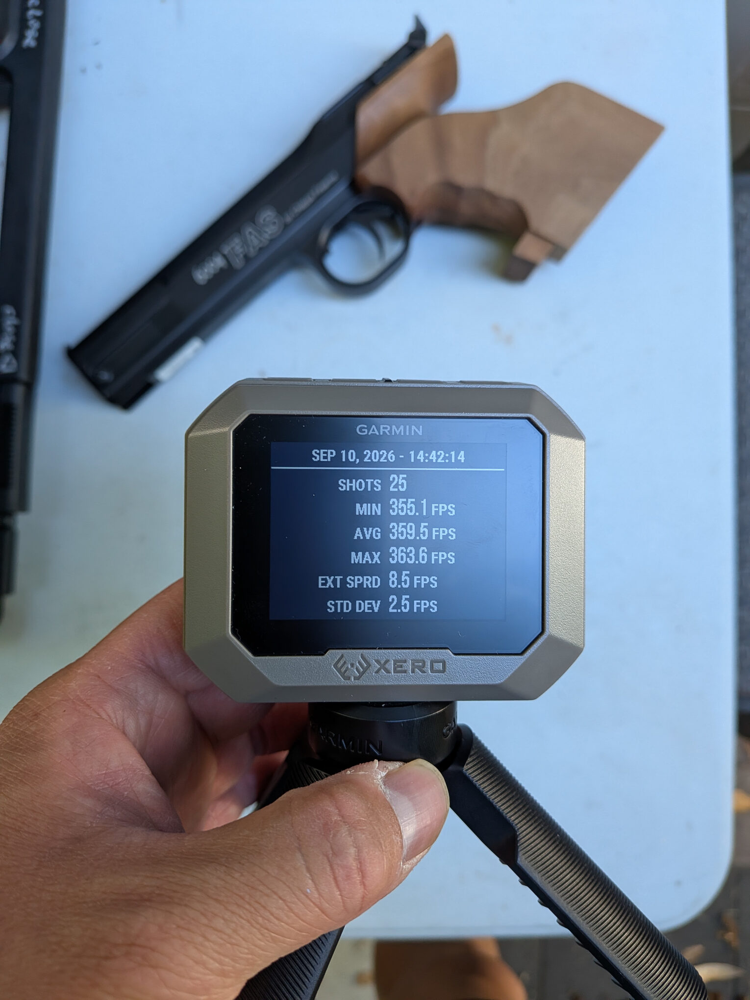

| Measurement | Velocity (fps / m/s) |
| --- | ---: |
| Minimum | 355.1 / 108.23 |
| Average | 359.5 / 109.58 |
| Maximum | 363.6 / 110.83 |
| Extreme spread | 8.5 / 2.59 |
| Standard deviation | 2.5 / 0.76 |

The entire **25-shot string stayed within an 8.5 fps range**, about 2.4% of the average velocity. The standard deviation was only 2.5 fps, or about 0.7% of the average. That is encouraging consistency for this pistol and pellet combination in this session.

The measured average of 359.5 fps falls between Chiappa's current and older published figures. For target shooting, the small variation from shot to shot is the more interesting result here. A chronograph does not establish group size or accuracy on its own, but this string provides a useful indication of how consistently the pistol delivered velocity with RWS R10 Match pellets.

## My Take So Far

The looks were what persuaded me to buy the FAS 6004, and the consistency in this 25-shot session gives me another reason to appreciate it. For someone drawn to a compact SSP with a sculpted wooden grip and no separate air supply to manage, I think its appeal is easy to understand.

Shooting it has added to that appeal. The match grip feels comfortable and steady, and the crisp, simple sight picture suits me better than those of my HW45 and HW75. These are still my initial impressions, but the FAS is giving me reasons to enjoy it beyond its looks.

## Sources

- [Chiappa FAS 6004 specifications](https://www.chiappafirearms.com/product/440.040/)
- [Weihrauch HW75 specifications](https://www.weihrauch-sport.de/air-pistols/hw-75?lang=en)
- [Weihrauch's 2024 catalog for the HW75 velocity](https://www.weihrauch-sport.de/wp-content/uploads/2024/05/KATALOG-WEIHRAUCH-SPORT-125-Years-Stand-05-2024-fuers-Web-Doppelseiten-MIT-Mittellinien.pdf)
- [Air Venturi V10 specifications](https://www.airventuri.com/products/v10-match-air-pistol).
