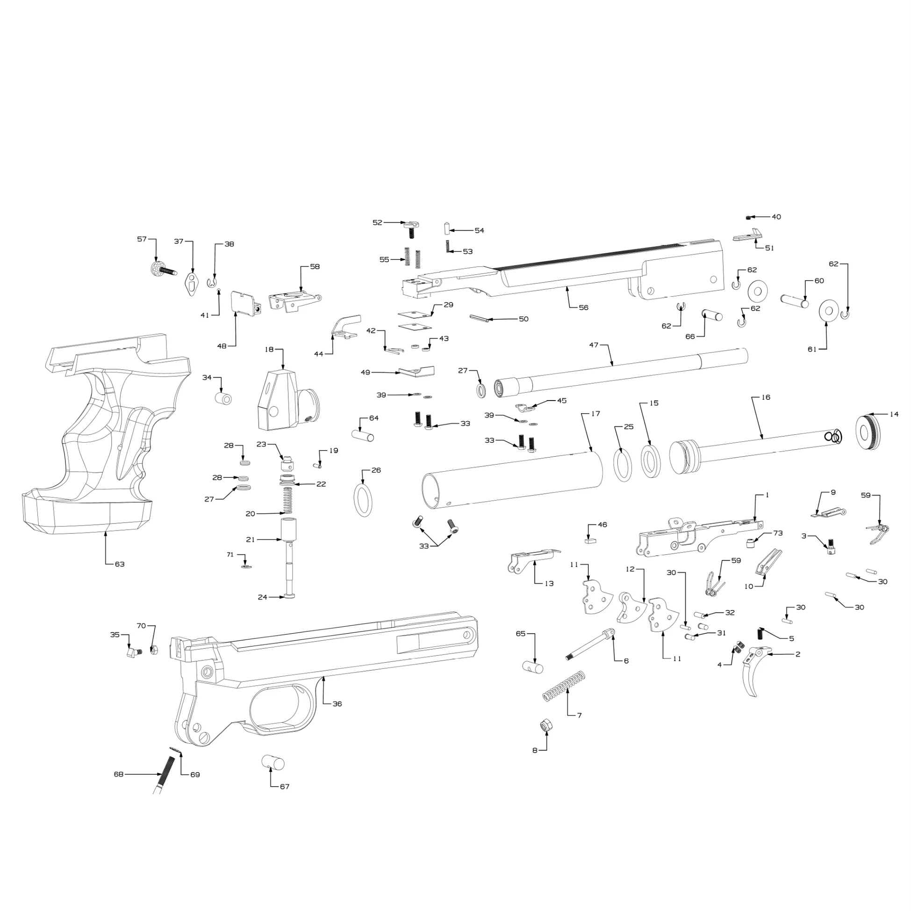
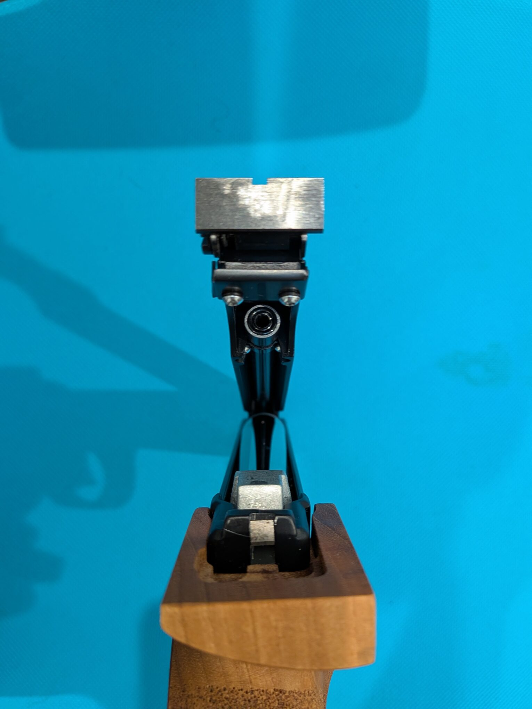
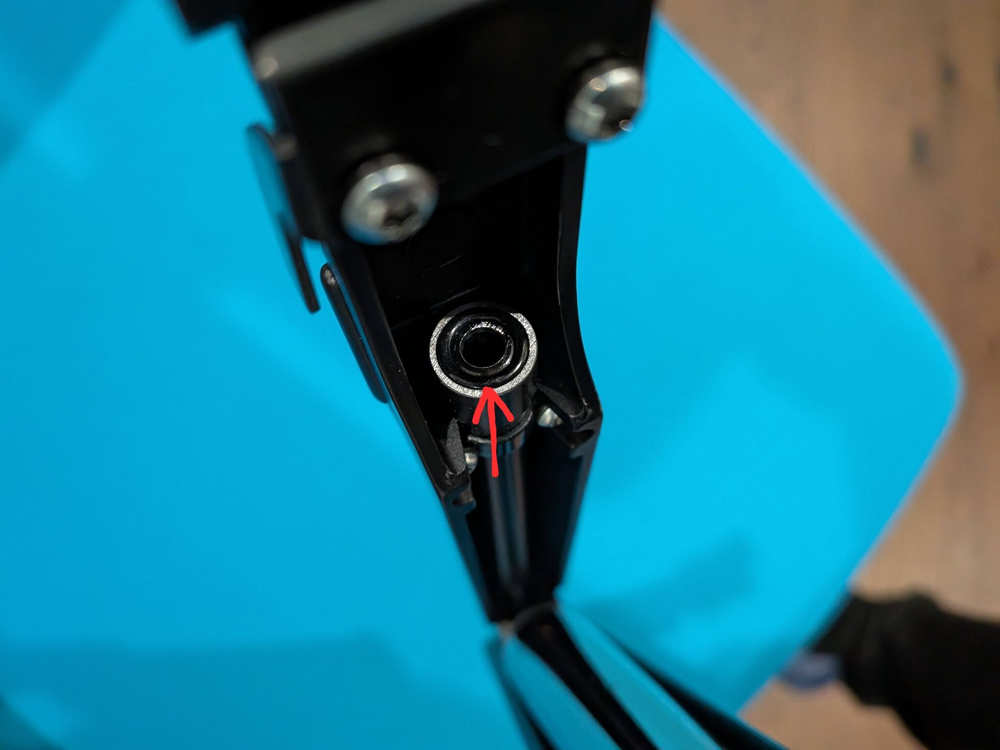
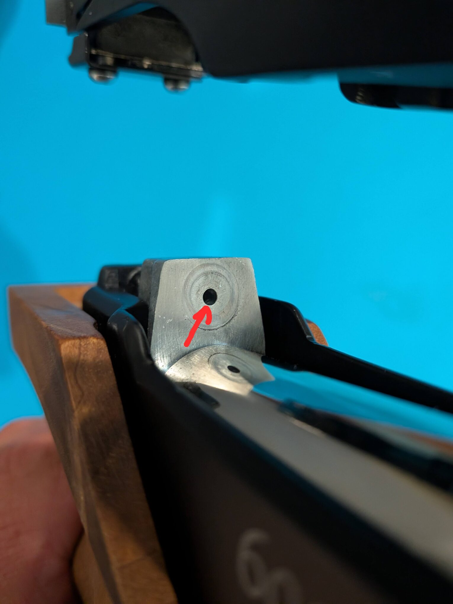

In my [first FAS 6004 review](/blog/fas_6004_intro/), I wrote about the design, shooting experience, and chronograph results. This time, I want to share the maintainence story every airgun owner will eventuall face: the seals.

O-rings are wear items, and it makes sense to plan for replacements over the life of the pistol. The one that has needed my attention so far is the **breech O-ring, reference #27 in the exploded diagram**. On my pistol, its lower edge wore more quickly than I expected. Finding the correct size was only part of the story; the surface it touched during closure mattered too.

## The Breech Seal on My Pistol

The breech O-ring sits at the rear end of the barrel. When the upper assembly closes, it meets the face of the valve body, **#18**, around the air outlet. The open-pistol photo below shows the two surfaces facing each other.

I noticed wear concentrated on the **lower portion of the O-ring**. Watching how the parts came together, it appeared that this portion could touch the relatively sharp edge of the valve-body opening before the upper assembly was fully closed. That slight contact seemed to explain the localized wear I was seeing.

**Despite the visible wear on its lower portion, the #27 breech O-ring still works.** I have continued using the pistol for more than three months since first noticing the wear, with **no observed drop in FPS** over that period. On my pistol, the visible wear has not been accompanied by a loss of velocity.

- *Left: the lower part of the breech seal where I noticed wear.*
- *Right: the edge of the valve-body opening that appeared to contact it during closure.*

**Polishing that edge helped reduce the wear on my pistol.** But if you are not comfortable do the job yourself, have a qualified airgun technician assess and repair it. The [Chiappa manual](https://www.pyramydair.com/airgun-resources/manuals/FAS-6004-Air-Pistol-Manual.pdf#page=4) directs repairs to professional gunsmiths. Any inspection should begin with the pistol unloaded and unpressurized.

## The Replacement I Bought

The manual lists #27 as *6.75 mm inside diameter × 1.78 mm cross-section*, under part code *160.033*. I bought replacements from [The O-Ring Store: N1.78X006.75, Buna-N/NBR, 70 durometer, BS610](https://www.theoringstore.com/store/index.php?main_page=product_info&cPath=368_12_43&products_id=16720).

There is a related discussion in [slofyr's “Improve the FAS 6004” post on TargetTalk, dated October 10, 2016](https://www.targettalk.org/viewtopic.php?p=256605#p256605). The author considered the standard breech O-ring too small and described an alternative seal with a broader contact surface. I also tried [this one](https://www.theoringstore.com/store/index.php?main_page=product_info&cPath=368_12_41&products_id=1863). However it was too large to install in my 6004. Although the numbers look close, it is a thicker ring as well as having a slightly larger inside diameter. I would not treat it as a direct substitute for the manual's size.

For my pistol, the useful lesson was to pay attention to the contact that was damaging the seal, rather than assume a larger ring would solve the problem.

## Matching the O-Rings to the Exploded Diagram

The [manual's parts list on page 8](https://www.pyramydair.com/airgun-resources/manuals/FAS-6004-Air-Pistol-Manual.pdf#page=8) identifies four O-ring references: **#25, #26, #27, and #28**. The exploded view uses #27 in two places—at the breech and in the valve assembly—and shows two #28 rings. Taken together, the drawing shows six O-rings across those four references.

*Match the reference numbers in the opening diagram to the table below. The [manual's page 9](https://www.pyramydair.com/airgun-resources/manuals/FAS-6004-Air-Pistol-Manual.pdf#page=9) also provides a zoomable exploded view.*

All dimensions below are **inside diameter × cross-section, in millimeters**. The locations and quantities follow the exploded drawing. The shopping links are specification-based candidates; I have not tested the internal-seal replacements listed here.

| Reference and location | Manual specification | Replacement listing |
| --- | --- | --- |
| **#25 — piston seal**; 1 shown | **160.031**; O-ring 3068; **17.13 × 2.62**; **Viton** | [The O-Ring Store V75115](https://www.theoringstore.com/store/index.php?main_page=product_info&products_id=3607): AS568-115, FKM, 75 durometer; seller lists **17.12 × 2.62**. Untested candidate. |
| **#26 — cylinder-to-valve-body seal**; 1 shown | **160.014**; **17.13 × 2.62** (printed as “OR 2.62X17.13”); material not stated | [The O-Ring Store B70115](https://www.theoringstore.com/store/index.php?main_page=product_info&products_id=1125): AS568-115, Buna-N/NBR, 70 durometer; seller lists **17.12 × 2.62**. Untested size candidate. |
| **#27 — breech and valve assembly**; 2 shown | **160.033**; O-ring 106; **6.75 × 1.78**; material not stated | [The O-Ring Store N1.78X006.75](https://www.theoringstore.com/store/index.php?main_page=product_info&products_id=16720): **6.75 × 1.78**, Buna-N/NBR, 70 durometer, BS610. Bought for the breech; untested in the valve. |
| **#28 — small valve seals**; 2 shown | **160.034**; O-ring 2015; **3.69 × 1.78**; material not stated | [The O-Ring Store B70007](https://www.theoringstore.com/store/index.php?main_page=product_info&products_id=1103): AS568-007, Buna-N/NBR, 70 durometer; seller lists **3.68 × 1.78**. Untested size candidate. |

There are two details worth checking before ordering. First, the seller lists the AS568-115 and AS568-007 inside diameters **0.01 mm below the manual's figures**. I have kept both values visible instead of presenting them as identical specifications. Second, the manual specifies Viton only for #25 and does not give hardness ratings for any of these rings. A dimensional match alone does not verify a replacement's material or suitability. Confirm the compound and hardness with Chiappa or a qualified service technician before ordering internal seals.

The manual's names “106,” “2015,” and “3068” also should not be assumed to be AS568 dash numbers. In particular, searching for **AS568-106** would not identify the 6.75 × 1.78 mm breech ring. Use the dimensions and material requirements alongside the part code.

For an alternative to buying individual sizes, [Bagnall and Kirkwood's FAS 6004 parts page](https://spares.bagnallandkirkwood.co.uk/chiappa-fas-6004/) lists a model-specific O-ring kit. Confirm its contents and suitability for your pistol with the seller. Product specifications, minimum order quantities, and availability should be checked when ordering; the links above were reviewed on September 29, 2026.

## What I Will Keep Watching

The breech seal is the one I will be checking most closely because of the wear I have already seen. I would keep spares in the manual's size and pay attention to recurring damage in the same area. I would not put every seal on a fixed replacement schedule based on this experience alone.

The internal O-rings may need attention as the pistol ages, but the table is a reference for sourcing and discussing service, rather than a reason to dismantle a working pistol. For routine care, I would start with the [manual's cleaning and lubrication guidance on pages 6–7](https://www.pyramydair.com/airgun-resources/manuals/FAS-6004-Air-Pistol-Manual.pdf#page=6).

I still enjoy shooting this little pistol. Understanding why its breech seal was wearing has simply become part of getting to know it better.

## Sources

- [Chiappa FAS AP6004 instruction manual](https://www.pyramydair.com/airgun-resources/manuals/FAS-6004-Air-Pistol-Manual.pdf): parts list on page 8 and exploded view on page 9; these pages carry a September 2014 footer.
- [TargetTalk: “Improve the FAS 6004,” opening post by slofyr](https://www.targettalk.org/viewtopic.php?p=256605#p256605): related owner discussion of breech-seal contact, not confirmation of the JIS P7 ring's fit.
- The O-Ring Store product listings linked beside each size above: seller dimensions, materials, hardness ratings, and model numbers.
- [Bagnall and Kirkwood: Chiappa FAS 6004 parts](https://spares.bagnallandkirkwood.co.uk/chiappa-fas-6004/): model-specific seal-kit listing.
