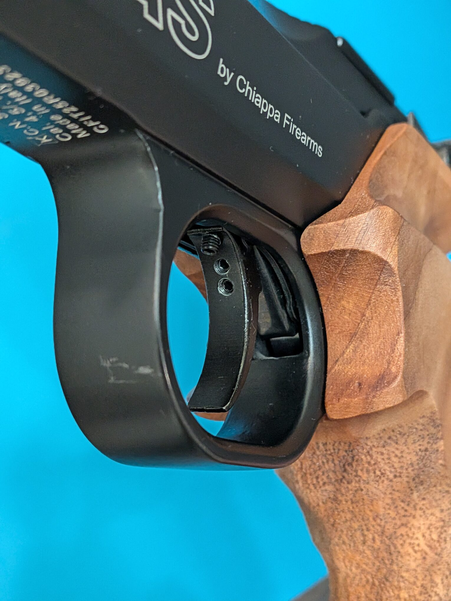
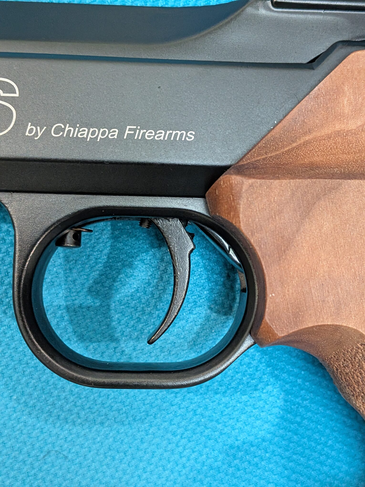

import FasTriggerAnimation from '../../components/FasTriggerAnimation.astro';

After writing about the FAS 6004's [shooting experience](/blog/fas_6004_intro/) and [O-ring maintenance](/blog/fas_6004_maintenance/), I wanted to take a closer look at its trigger. The manual identifies four adjustment screws, but a still drawing leaves quite a lot for the reader to imagine.

This post brings the controls, my close-up photos, and an interactive illustration together. **The goal is to understand what each screw controls and how the parts relate to one another.** For the manufacturer's adjustment instructions, see the [Chiappa manual, pages 5–6](https://www.pyramydair.com/airgun-resources/manuals/FAS-6004-Air-Pistol-Manual.pdf#page=5).

## Watch the Trigger Sequence

Press **Play sequence** to follow the pull, or use **Next stage** and the slider to look at a particular moment. **Inspect screws 1–4** brings the controls and their connecting parts into view; it is especially useful on a phone.

<FasTriggerAnimation />

The underlying cutaway is of the earlier **FAS 604**. I used my FAS 6004 photos to include the rear shoulder on its trigger blade. The animation is an explanatory model: it does not establish exact clearances, spring forces, or travel for an individual pistol. The two models should not be assumed identical in every detail.

## Match the Numbers to the Manual

The colored parts use letters so they cannot be confused with the screw numbers: **A is the trigger blade, B the sear, C the hammer, and D the valve.** Numbers **1–4** follow the manual's trigger-adjustment diagram, not the separate exploded parts list.

| Screw | Manual's description | Where to look in the illustration |
| --- | --- | --- |
| **1** | Trigger weight | At the front of the spring-and-lever assembly |
| **2** | Trigger stroke and position | Just ahead of blade A |
| **3** | First-stage drop point | Upper screw on blade A |
| **4** | Second-stage release | Lower screw on blade A |

This distinction helped make the drawing easier to read: the screws are controls, while the letters identify the parts involved in the sequence.

## Screw 1: Trigger Weight

Trigger weight is the force needed to pull the trigger. Screw 1 belongs to the spring-and-lever assembly ahead of the blade. In the animation, the trigger spring is purple and its connecting lever is teal, separate from the coral hammer spring farther back.

The linkage explains the relationship: **spring resistance reaches the trigger blade through the connecting parts**. Changing the spring's loading changes the resistance felt at the blade.

## Screw 2: Stroke and Position

The manual groups **stroke and position** under screw 2 and describes its role in trigger take-up. It affects the blade's starting position and take-up travel.

The close-up below shows the blade and the surrounding assembly on my pistol.

## Screws 3 & 4: First / Second Stages

These were the least obvious controls to me. The manual identifies their functions but gives little explanation of how their contact sequence produces the two stages. Both screws are mounted in trigger blade A and move with it.

Here is my interpretation of the sequence, as shown in the animation:

1. The pull begins with **initial free travel**, before either screw contacts sear B.
2. As the blade moves rearward, **upper screw 3 contacts sear B first**. How far it protrudes affects when this initial contact occurs.
3. As the pull continues, **lower screw 4 contacts sear B while screw 3 loses contact**. Screw 4 bears on the sear closer to its pivot. My understanding is that this change in leverage accounts for the increased resistance felt as the second stage begins.
4. Finally, sear B releases hammer C. The hammer acts on valve D, allowing compressed air to enter the barrel.

Some **caveats** from my observations and interpretation of the mechanism:

- If screw 3 protrudes too far relative to screw 4, screw 4 may not contact the sear before release. The trigger may then feel like a single-stage trigger, without a distinct second-stage “wall” to indicate that release is approaching.
- If screw 4 protrudes too far, it may contact the sear before screw 3. This can make the trigger feel like a heavier single-stage trigger.
- **The corner of the rear shoulder on blade A should not contact sear B before screw 4.** This happened on my pistol, and the second stage became unusually heavy. I guess the shorter distance between that contact point and the sear pivot explains the increased resistance.
- Excessive protrusion of either screw may allow the hammer to release with very little trigger movement.
- With the pistol uncocked, I would expect some clearance between screw 3 and sear B, rather than continuous contact that keeps the parts under load.

## References

The [Chiappa FAS AP6004 instruction manual](https://www.pyramydair.com/airgun-resources/manuals/FAS-6004-Air-Pistol-Manual.pdf#page=5) is the reference for the four control descriptions. Its trigger section spans pages 5–6. Use the instructions appropriate to your pistol and consult Chiappa or a qualified airgun technician if the mechanism or its behavior differs from the manual.

The animation uses a supplied FAS 604 cutaway whose original publication source I have not confirmed. The accompanying FAS 6004 photographs are my own. The cutaway, photos, and manual support different parts of this explanation; none provides a measured recording of the internal motion.

## More about the FAS 6004

- [FAS 6004 review: shooting impressions and chronograph results](/blog/fas_6004_intro/)
- [FAS 6004 maintenance: O-ring sizes and breech seal wear](/blog/fas_6004_maintenance/)
