## A Brief Introduction

The Weihrauch HW45 is one of the most unusual air pistols I've owned. Its solid metal construction and 1911-style grip feel familiar, while **two power settings and a crisp trigger** add to its appeal.

Unlike my smoother HW75 or HW40, it delivers **strong mechanical vibration with every shot**. Its spring-piston action makes accurate shooting more demanding, but learning to manage it is part of the attraction for me.

In my tests, full power averaged **nearly 612 fps with 7-grain pellets**, with consistent velocity at both settings. Yet my low-power group was tighter at 15 yards. More power is only part of this pistol's story.

## First Impressions

The first thing that stands out is the **1911-like outline beneath a much taller upper assembly**. The silver-colored frame, black upper section, and dark checkered grip panels give this example a distinctive appearance.

Alongside the [HW75](/blog/hw75_intro/), their **metal frames look almost identical externally**. The main differences are in the power plant and grips: the HW45 uses a spring-piston action and 1911-style grip panels, while the HW75 uses a single-stroke pneumatic action and a contoured walnut grip.

Despite the HW75's more sculpted grip, I find the **HW45's 1911-style grip more comfortable in my (small) hand**. That is my personal fit preference; another shooter may feel differently.

### Sights

On my HW45, the red plastic fiber-optic rod in the front sight **snapped when it hit the table**, leaving the dark sight body visible. I find the exposed rod fragile. The photos below compare it with the HW40's very similar front sight, which still has its red rod intact: HW45 on the left, HW40 on the right.

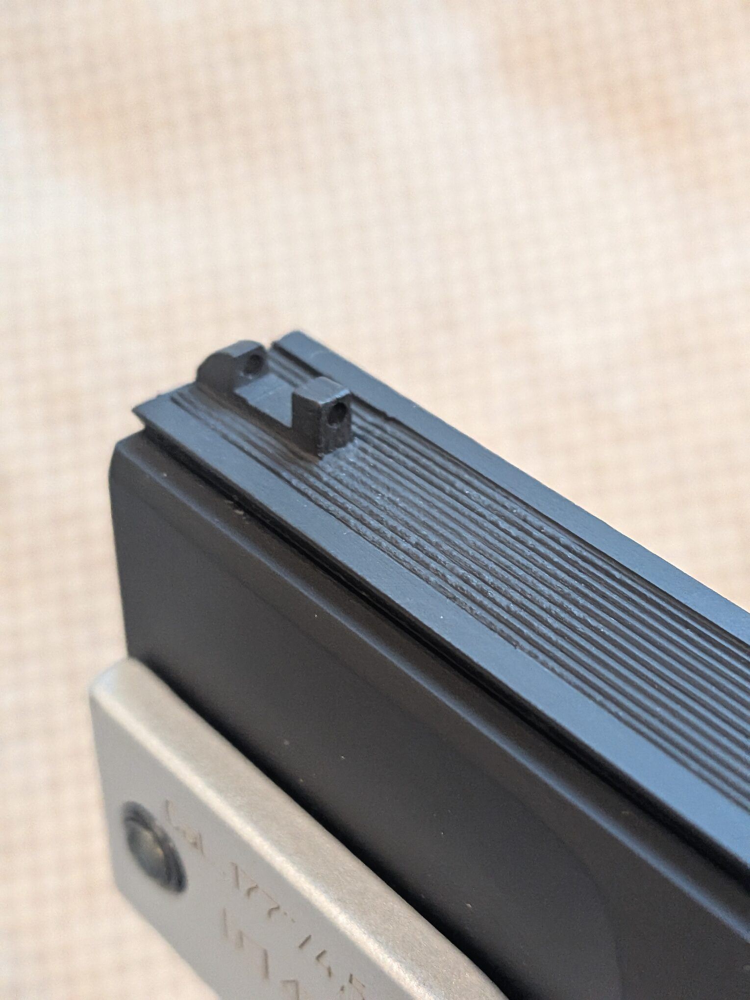

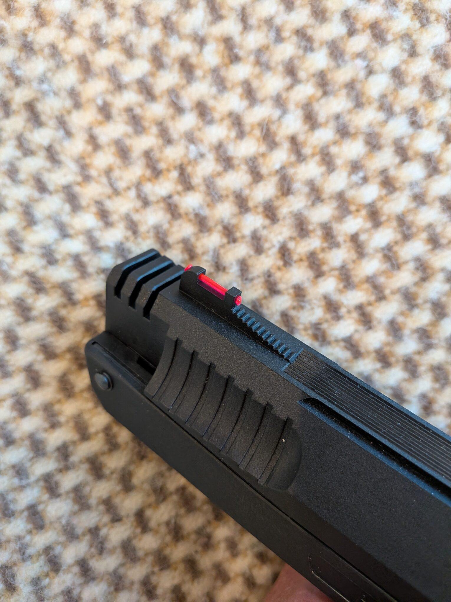

The rear sight is **adjustable for windage and elevation**, with green fiber-optic inserts on either side of the notch. Viewed from behind, the green rear dots stand out against the black sight body.

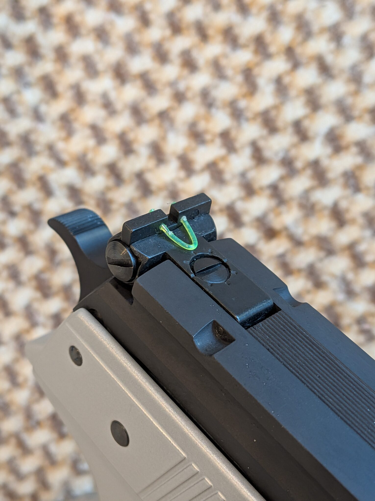

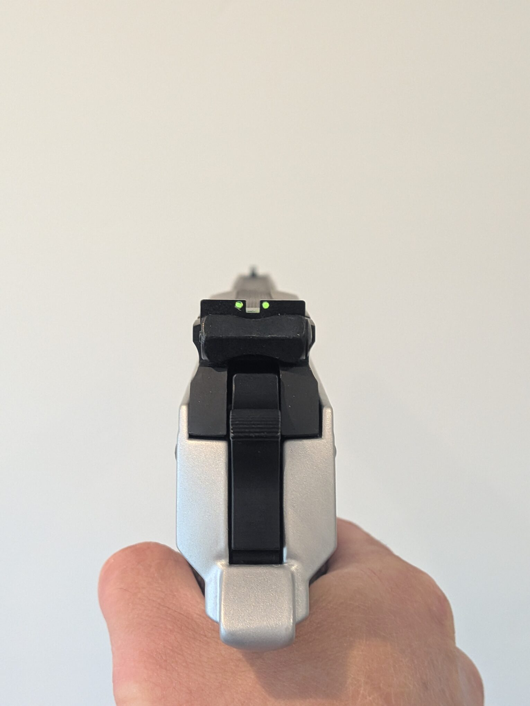

### Replaceable 1911-Style Grips

The grip uses two separate checkered panels, each secured by two screws. It has the familiar shape of a service-pistol grip, without the palm shelf of a dedicated target grip.

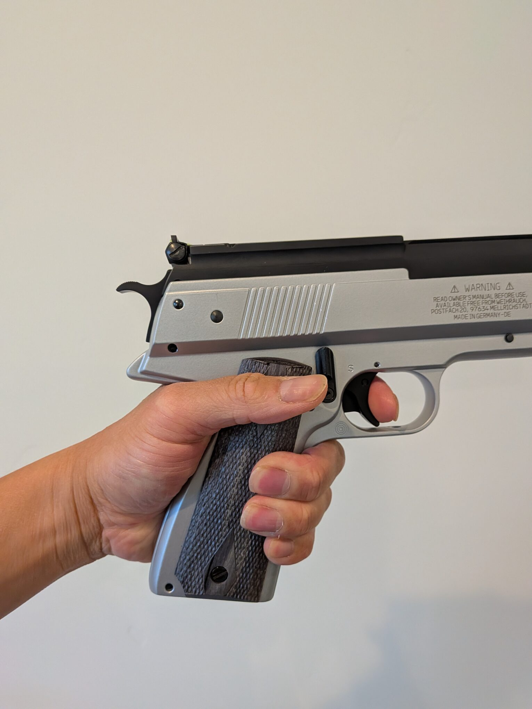

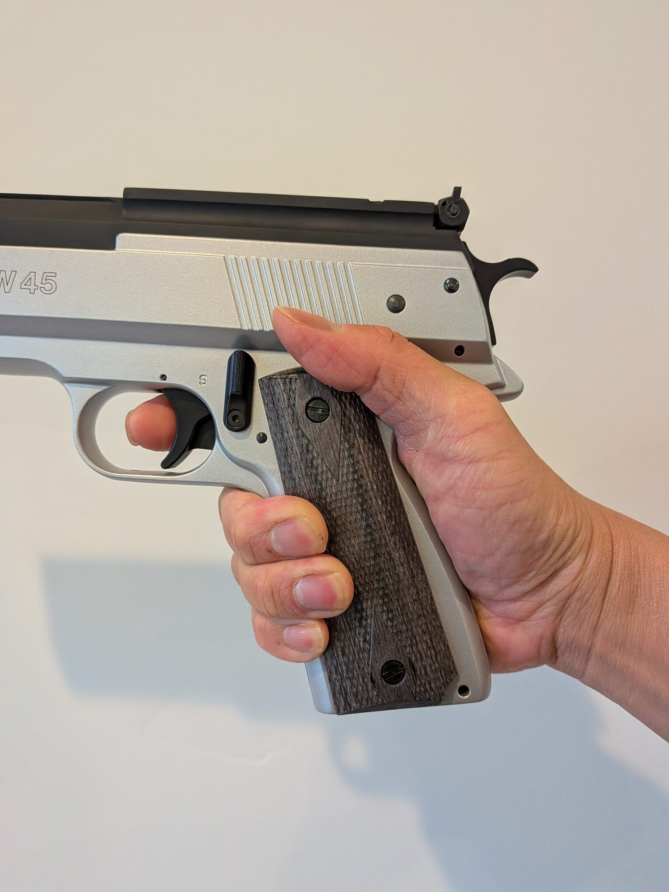

One useful feature is compatibility with **standard full-size 1911-style grip panels**, documented in [Gaylord's P1/HW45 review](https://www.pyramydair.com/blog/2007/05/beeman-p1hw45-air-pistol/). This gives the pistol options for different textures and contours. Fit still needs checking for the particular grip, including clearance around the safety.

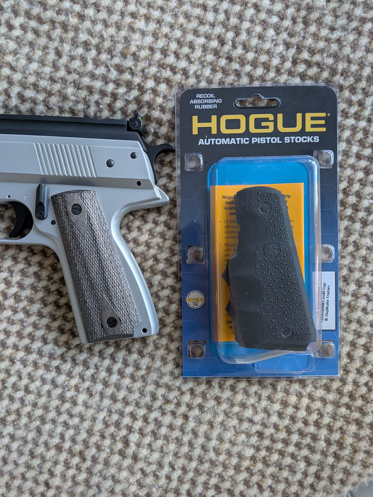

The Hogue replacement grip pictured alongside the pistol is one example.

### Two Cocking Positions, Two Power Levels

The hammer-shaped part at the rear is the **latch for the upper assembly**. Releasing it lets the top lift and pivot forward around the front hinge. The upper assembly also acts as the cocking lever.

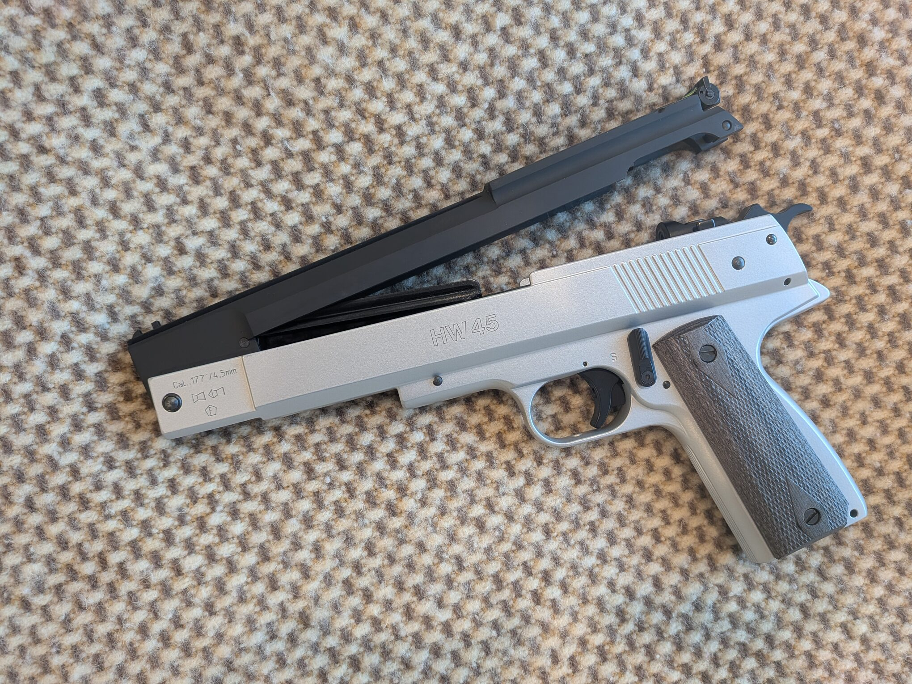

The two power settings come from **two cocking positions**. The first catch selects low power; opening farther to the second catch selects full power. The side-by-side photos show **low power on the left** and **full power on the right**.

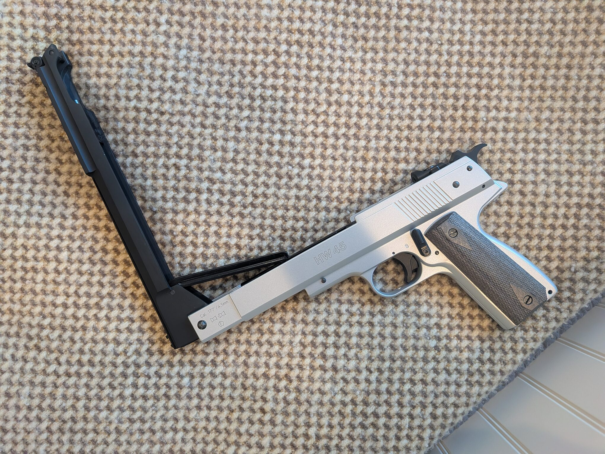

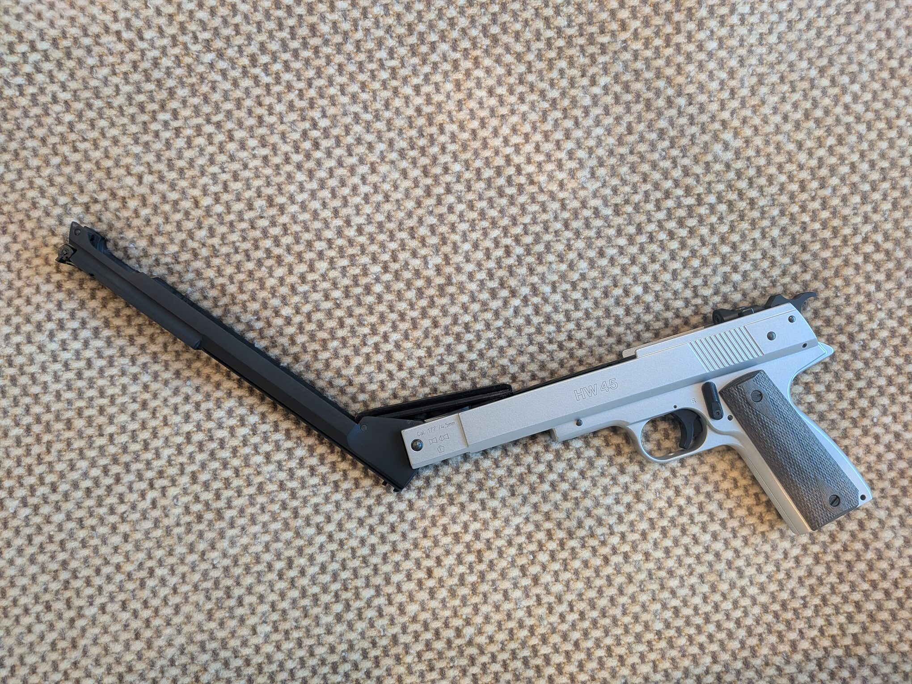

Lower power does not necessarily mean much less cocking effort, as [Tom Gaylord notes in his P1 review](https://www.pyramydair.com/blog/2011/04/beeman-p1hw-45-air-pistol-part-1/). Changing power can also change the point of impact, so the two settings should not be assumed to share the same sight zero.

### Breech and Seal

Opening the upper assembly exposes the breech for loading a pellet directly into the barrel. A circular seal around the air outlet seals against the barrel when closed.

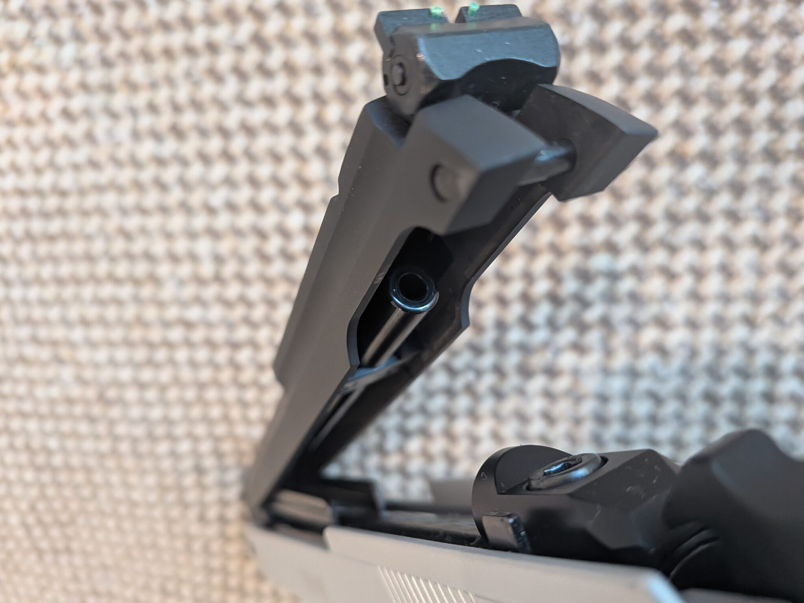

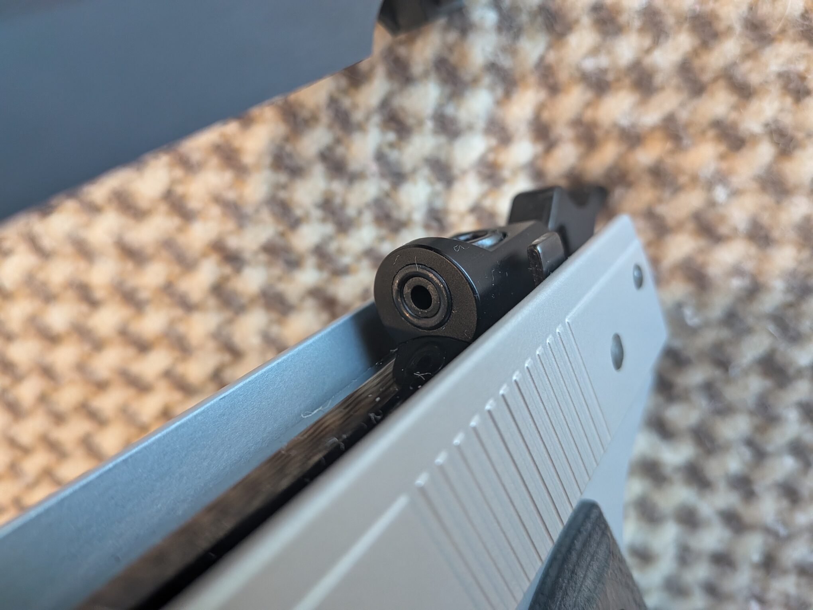

### Manual Safety

The **manual safety has a lever on each side**, above the grip and behind the trigger. It does not engage automatically when cocking, as noted in the [HW45 manual](https://www.weihrauch-sport.de/wp-content/uploads/2023/01/HW-45-de-fr.-engl.-03-2020.pdf#page=15).

### Two-Stage Trigger

The grooved trigger has a **two-stage action**, with initial take-up followed by the release.

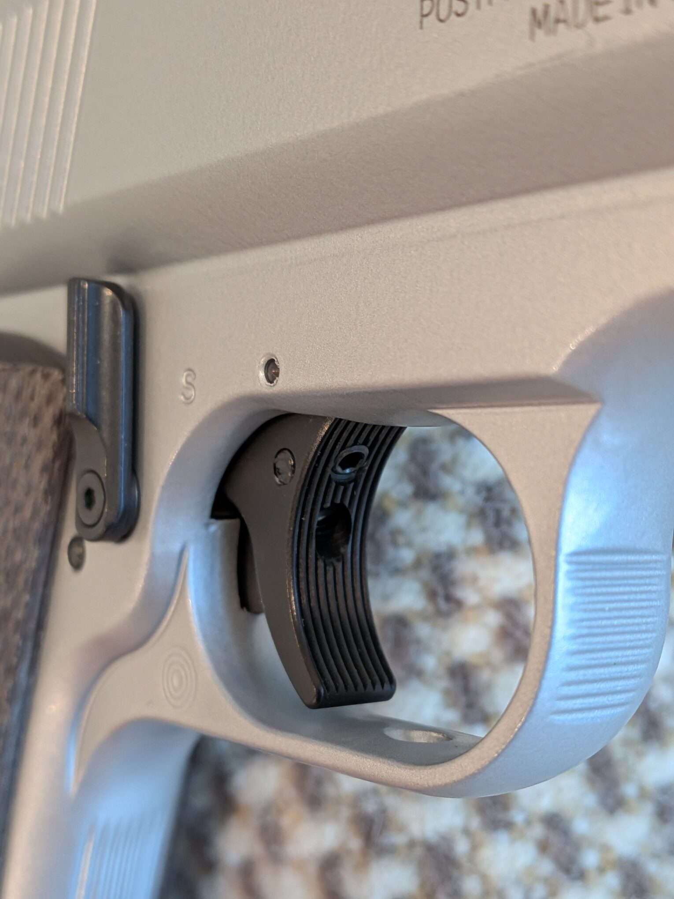

The [manual](https://www.weihrauch-sport.de/wp-content/uploads/2023/01/HW-45-de-fr.-engl.-03-2020.pdf#page=29) shows adjustments for **first-stage travel** and the **second-stage let-off point**, and recommends keeping the factory settings or using a qualified airgunsmith.

## Shooting Experiences

I find the trigger **crisp, with a clear break**, very close in feel to the HW75's match-grade trigger. The first stage is very light, leading to a distinct wall. A little more pressure then produces a crisp release. Although it is a two-stage trigger, that light take-up makes it feel almost like a single-stage trigger to me; the HW75 feels very similar. That predictable release helps me shoot more accurately.

<figure class="video-embed">
  <iframe src="https://www.youtube-nocookie.com/embed/LO8qd6CDHtQ" title="HW45: cocking the pistol at low power and full power" width="560" height="315" loading="lazy" allow="accelerometer; autoplay; clipboard-write; encrypted-media; gyroscope; picture-in-picture; web-share" referrerpolicy="strict-origin-when-cross-origin" allowfullscreen></iframe>
  <figcaption>Cocking the HW45 at low power and full power. <a href="https://youtu.be/LO8qd6CDHtQ">Watch the cocking demonstration on YouTube</a>.</figcaption>
</figure>

When shooting, I feel a **strong, distinctive vibration from the HW45**, much more pronounced than with my HW75 or HW40. This character comes from its [spring-piston action](https://www.weihrauch-sport.de/air-pistols/hw-45?lang=en): releasing the spring drives the internal piston rapidly to compress the air for the shot, producing recoil and vibration as those parts move and slow down.

The [HW75](https://www.weihrauch-sport.de/air-pistols/hw-75?lang=en) and [HW40](https://www.weihrauch-sport.de/air-pistols/hw-40-pca?lang=en) use air compressed before firing, without a large spring-driven piston moving during the shot. The video below shows the HW45's movement during shooting.

<figure class="video-embed">
  <iframe src="https://www.youtube-nocookie.com/embed/-5RF2XBncK4" title="HW45: vibration during shooting" width="560" height="315" loading="lazy" allow="accelerometer; autoplay; clipboard-write; encrypted-media; gyroscope; picture-in-picture; web-share" referrerpolicy="strict-origin-when-cross-origin" allowfullscreen></iframe>
  <figcaption>The HW45's vibration during shooting. <a href="https://youtu.be/-5RF2XBncK4">Watch the shooting demonstration on YouTube</a>.</figcaption>
</figure>

## Test Results

I recorded **15 shots at each power setting**, using **Meisterkugeln 7-grain pellets**. The table below summarizes the values reported by the chronograph app.

| Measurement | Full power | Low power |
| --- | --- | --- |
| Shots recorded | 15 | 15 |
| Average velocity | 611.9 fps | 504.1 fps |
| Minimum velocity | 606.5 fps | 496.7 fps |
| Maximum velocity | 616.4 fps | 506.7 fps |
| Extreme spread | 9.9 fps | 10.0 fps |
| Standard deviation | 2.7 fps | 2.4 fps |

### Full Power

The session summary and velocity chart are shown side by side.

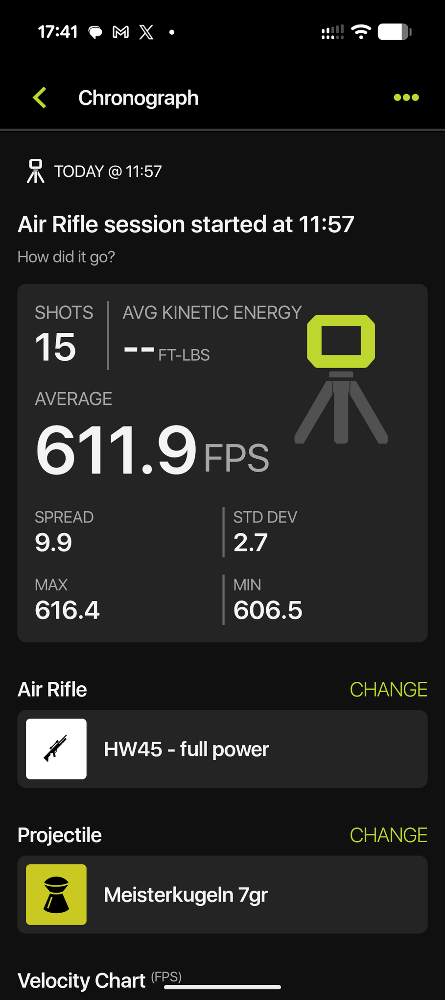

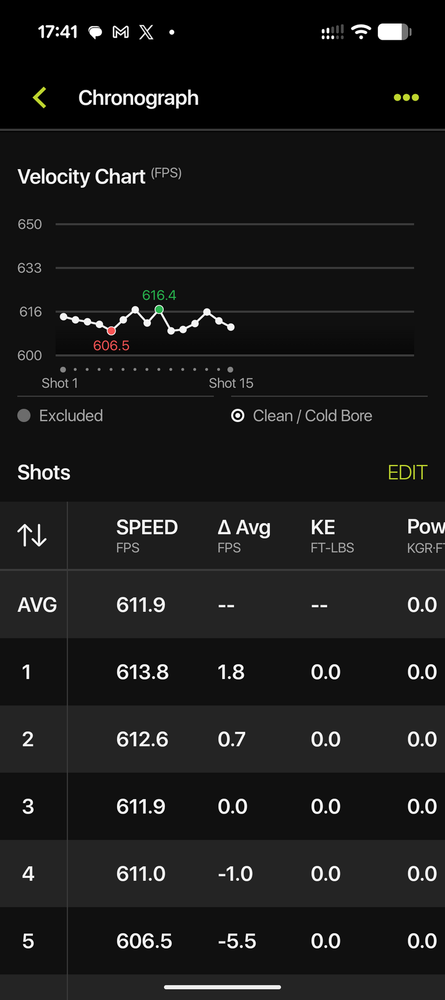

### Low Power

The app labels this session "partial power," corresponding to the first cocking position.

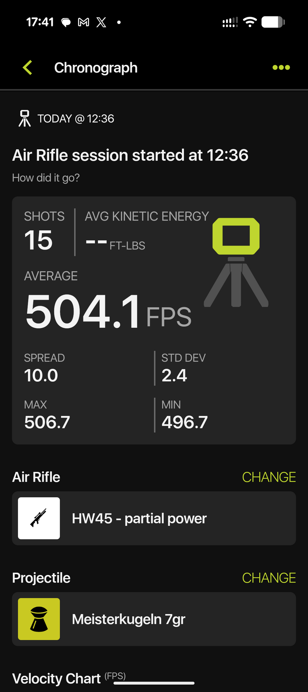

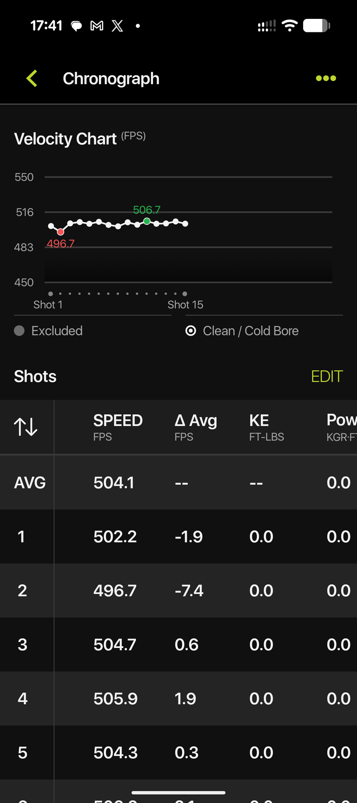

### What the Results Show

Full power increased the average velocity by **107.8 fps, or about 21.4%**, while keeping essentially the same extreme spread. The standard deviations are also close: 2.7 fps at full power and 2.4 fps at low power, both below 0.5% of their respective averages. The charts use different vertical scales, so the numerical results are a better comparison than how flat each line looks.

**Despite the HW45's strong vibration, its velocity was consistent in both 15-shot strings**, with no clear consistency penalty at full power. I find this encouraging for its shot-to-shot performance with this pellet.

### Target Results

The photo shows full power on the left and low power on the right, both at 15 yards. The **low-power shots form a more compact cluster**, possibly because the pistol is easier for me to control at that setting, although they land above the aiming point. Some of the wider shots were probably my own shooting errors.

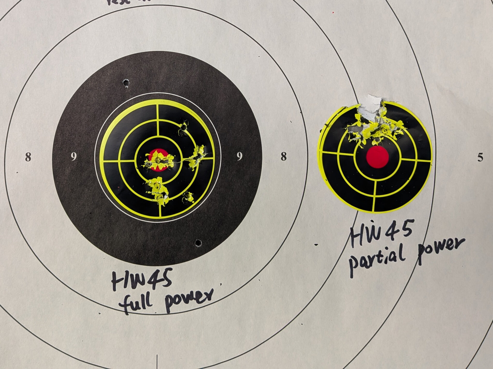

## Summary

In my opinion, the HW45 is a distinctive and enjoyable air pistol for recreational shooting and potentially small game hunting, with plenty to explore as a shooter and owner.

### What I Like

1. **Powerful spring-piston action.** It remains one of the most powerful spring-piston air pistols available, consistent with [Weihrauch's description](https://www.weihrauch-sport.de/air-pistols/hw-45?lang=en).
2. **Good accuracy at both power levels.** I find it capable of good accuracy even at full power, although low power may be more manageable for many shooters. My tighter low-power group at 15 yards reflects that preference.
3. **Two power settings.** This is still an unusual and useful feature among spring-piston pistols, letting me choose between lower power and the full-power shooting experience.
4. **Plenty of grip options.** The 1911-style grip opens up many possibilities for replacement panels with different materials, textures, and shapes.
5. **Quality construction.** The metal frame and upper assembly, paired with checkered walnut grips, give the pistol a solid, well-made feel.

### What I Don't Like

1. **Slightly top-heavy balance.** I find the pistol a little heavy above the grip, likely due to the bulk and weight of the spring-piston cylinder in the upper assembly.
2. **Fragile front sight insert.** The exposed fiber-optic rod on mine snapped when it hit the table. I would prefer better protection for this part.
